## Markus Tacker

:::::::::::::: {.columns}

::: {.column width="50%"}

**Senior R&D Engineer**

<small>[Markus.Tacker@NordicSemi.no](mailto:Markus.Tacker@NordicSemi.no)  
Twitter: [\@coderbyheart](https://twitter.com/coderbyheart)  
Instagram: [\@coderbyheart](https://instagram.com/coderbyheart)  
[coderbyheart.com](https://coderbyheart.com/)</small>

:::

::: {.column width="50%"}

- Joined Nordic in 2017.
- Member of <em>Cellular IoT Applications Team</em>.
- 1st full-time cloud engineer at Nordic.

:::

::::::::::::::

### Cellular IoT Applications Team

R&D  
 ↓  
Applications  
 ↓  
Cellular IoT Applications Team

## What is _cellular_ IoT?

### connect:anything

{width=25%} 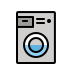{width=25%}

<small>(our slogan)</small>

### Usage of cellular IoT

<iframe width="560" height="315" src="https://www.youtube-nocookie.com/embed/GFqP9yHbayY?start=50" title="YouTube video player" frameborder="0" allow="accelerometer; autoplay; clipboard-write; encrypted-media; gyroscope; picture-in-picture" allowfullscreen></iframe>

## Thingy:91

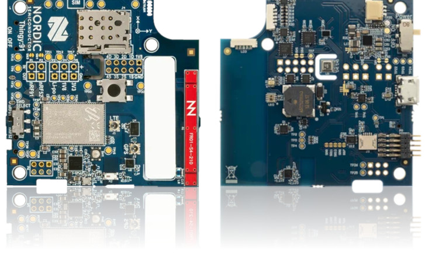{width=50%}

### Made by Nordic

Uses Nordic's [nRF9160 SiP](https://www.nordicsemi.com/Products/nRF9160) it is
an easy-to-use battery-operated prototyping platform for cellular IoT using
LTE-M, NB-IoT and GPS.

<small>[nordicsemi.com/Products/Development-hardware/Nordic-Thingy-91](https://www.nordicsemi.com/Products/Development-hardware/Nordic-Thingy-91)</small>

### User Interface

- 1 RGB LED
- 1 button
- Sound output
- Sound recording
- 4+ GPIO pins
- PC connection through USB

### Sensors

- temperature
- humidity
- air quality and pressure
- color and light sensor
- accelerometer

### Wireless

- Bluetooth (~10 m range)
- LTE-m / NB-IoT (~10 km range)

### Programming language

- C

### Price

- ~150 USD

### Cellular IoT

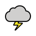{width=25%} {width=25%}
{width=25%}

## micro:bit

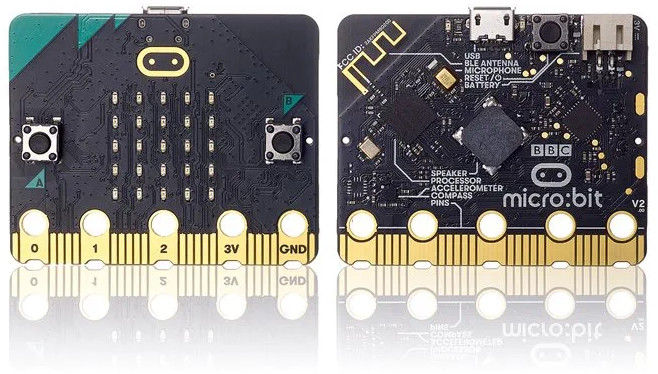{width=50%}

### Powered by Nordic

micro:bit employs Nordic’s **nRF52**833 SoC to support complex applications and
provide Bluetooth LE connectivity for creative digital education.

[microbit.org](https://microbit.org/)

### User Interface

- 5x5 red LEDs
- 2 buttons
- Sound output
- Sound recording
- 3 Pins plus 3V and ground
- PC connection through USB

### Sensors

- movement
- light
- temperature
- magnetic fields

### Wireless

- Bluetooth (~10 m range)

### Programming language

- Python
- JavaScript
- visual block editor

### Price

- ~30 USD

### UWB IoT (BLE)

{width=15%} {width=15%}
{width=15%} {width=15%}
{width=15%}

## Let's try it!

### Projects

:::::::::::::: {.columns}

::: {.column width="33%"}

[Soil moisture](https://makecode.microbit.org/projects/soil-moisture)

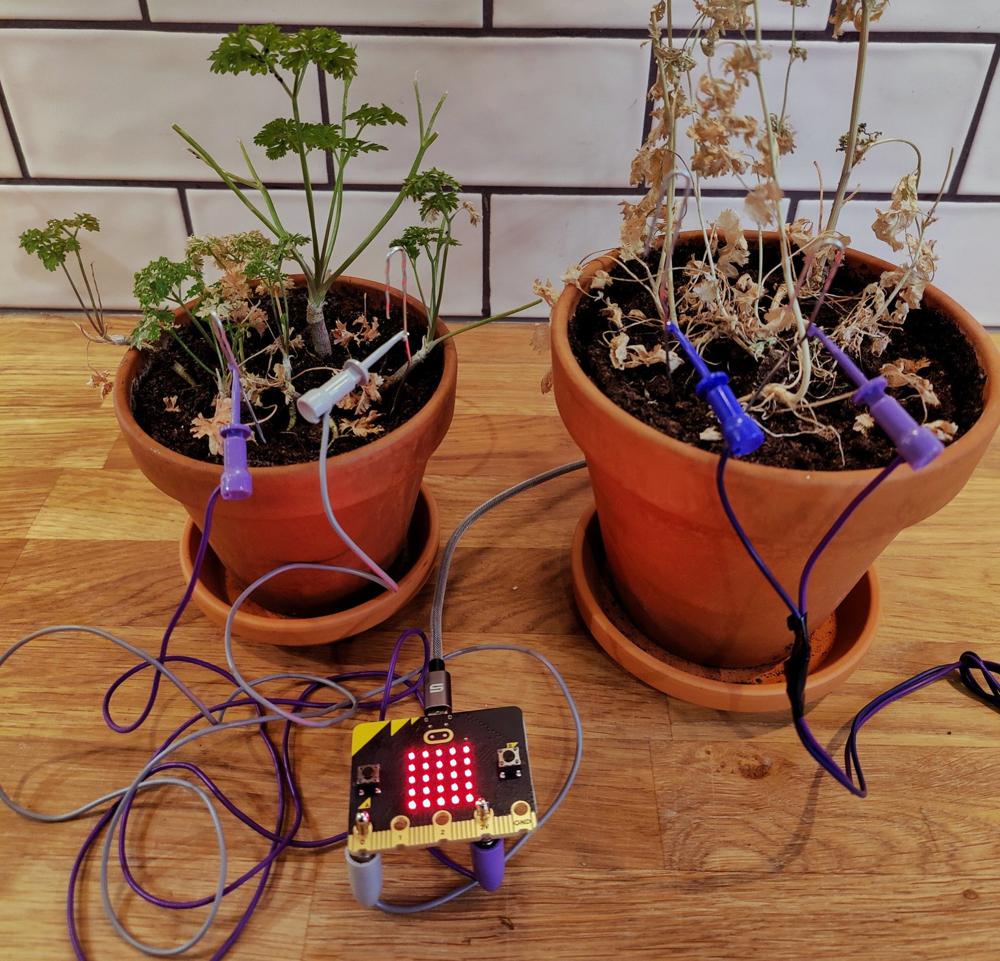

:::

::: {.column width="33%"}

[Name badge](https://microbit.org/projects/make-it-code-it/name-badge/)

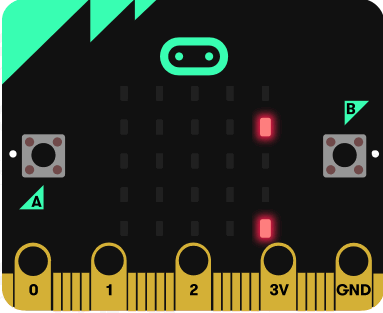

<small>Image source:
[microbit.org](https://microbit.org/projects/make-it-code-it/name-badge/)</small>

:::

:::{.column width="33%"}

[Step counter](https://microbit.org/projects/make-it-code-it/sensitive-step-counter/)

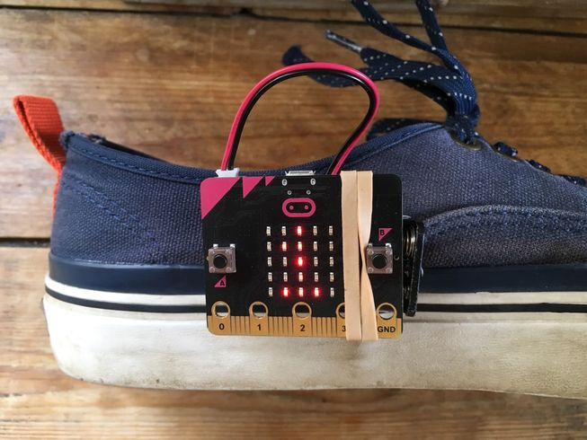

<small>Image source:
[microbit.org](https://microbit.org/projects/make-it-code-it/sensitive-step-counter)</small>

:::

::::::::::::::

### Mobile app

[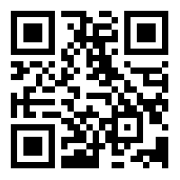{width="40%"}](https://bit.ly/3EOnocs)

`bit.ly/3EOnocs`

### Project (Links)

:::::::::::::: {.columns}

::: {.column width="33%"}

Soil moisture

[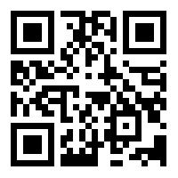](https://makecode.microbit.org/projects/soil-moisture)

`bit.ly/3kEw0dO`

:::

::: {.column width="33%"}

Name Badge

[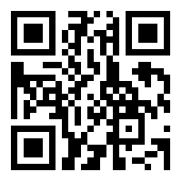](https://microbit.org/projects/make-it-code-it/name-badge/)

`bit.ly/3EP492n`

:::

:::{.column width="33%"}

Step Counter

[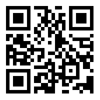](https://microbit.org/projects/make-it-code-it/sensitive-step-counter/)

`bit.ly/2XNga7l`

:::

::::::::::::::

## Thank you & happy connecting!

[{width=25%}](https://devzone.nordicsemi.com/)  
[devzone.nordicsemi.com](https://devzone.nordicsemi.com/)

- [Markus.Tacker@NordicSemi.no](mailto:Markus.Tacker@NordicSemi.no)
- Twitter: [\@coderbyheart](https://twitter.com/coderbyheart)
- Instagram: [\@coderbyheart](https://instagram.com/coderbyheart)

## Please return batteries

... if you are not planning to use them

{width=25%} {width=25%}

<small>All emojis designed by
<a href="https://openmoji.org/" target="_blank" rel="noopener noreferrer">OpenMoji</a>
– the open-source emoji and icon project. License:
<a href="https://creativecommons.org/licenses/by-sa/4.0/" target="_blank" rel="noopener noreferrer">CC BY-SA 4.0</a></small>

