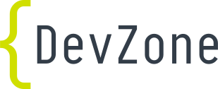

## About me

:::::::::::::: {.columns}

::: {.column width="50%"}

{width=50%}

:::

::: {.column width="50%"}

Markus Tacker

**Senior R&D Engineer**  

<small>[Markus.Tacker@NordicSemi.no](mailto:Markus.Tacker@NordicSemi.no)  
Twitter: [\@coderbyheart](https://twitter.com/coderbyheart)  
Instagram: [\@coderbyheart](https://instagram.com/coderbyheart)</small>

:::

::::::::::::::

## Thank you & happy connecting!

[{width=25%}](https://devzone.nordicsemi.com/)
